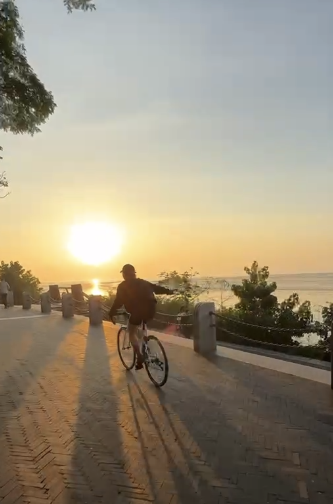

# 2024: A Year Surrounded by Light

Thanks to the people and moments in my 2024, I can truly say I’ve felt surrounded by light. In the beginning of this year, I received a special gift from Shuyang – a card that said: 祝吴丹丹2024一路有光 (Wishing Wu Dandan a year full of light). This simple message has stayed with me all year, and it truly encapsulates how 2024 has unfolded. This year has been incredible. I’ve been constantly inspired by the light of life and work, which has guided and motivated me forward. 

2024 was a year of significant change and growth, and for that, I am deeply grateful. Very beginning of the year, I stepped into the role of a leader in my product line, moving beyond just marketing. However, I’ll be honest – I don’t feel like a good or qualified manager yet. I even look back at my thoughts from June and see how much I still had to figure out. I’ll attach those reflections here, as they show how far I've come, but also remind me how much I still have to grow. To my amazing team, thank you for having bared with me and grown alongside me through it all. 

Looking back at the end of the year, I’m proud to say that our team achieved remarkable year-over-year growth, building on a strong foundation from 2023. We launched three new products: the reCamera, reComputer Mini, and reServer J501. I’m incredibly proud of the dedication and hard work my team put into every step of product development—whether it was perfecting the user experience, creating new products, or expanding applications. Two years ago, my VP advised me to treat the team (which was only four people at the time) as a startup. Now, with ten of us, I truly believe we’ve made it because everyone on the team has contributed with passion and ownership, building products they genuinely believe in. 

Shenzhen has some of the most beautiful sunsets—just like in California! Welcome to visit Shenzhen!

The company’s business path revolves around developers— to developers to business (2D2B)—and they are truly at the core of everything we do. Although I’ve never worked in a model of direct to business before so I don't know how it will work. Over the past seven years, the users I’ve interacted with most have been developers. There’s a much shorter distance between the product team and the end user either when we cook or promote the product. This close connection makes it easy for us to collaborate and continuously improve the product. I believe a big reason for this is that our products are open-source, designed to be developed, and customized, — that’s different from commercial products. Working with global developers feels like a unique opportunity, not just to improve our products, but to co-create with them. It reminds me of Mark Zuckerberg's words about LLaMA 3: “We’re doing it both as open-source for the developer community, and it’s now going to power Meta AI.” This mindset of collaboration and openness is at the heart of what drives innovation at Seeed of course.

## Musings on Bay2Bay: Bay of Shenzhen, Bay of Silicon Valley 
One of the highlights of this year was an unexpected business trip to the Bay Area. I extended my work trip into a brief vacation and spent ten days shuttling back and forth between Palo Alto and San Francisco. That two weeks, I gained a fresh perspective on both work and life in the Bay Area. The trip was packed with meetings, events, and opportunities to guide my team in new directions(Robotics!). Although it’s too early to call it a strategic shift, I do feel like we’ve uncovered something worth exploring further in the coming year. While in the Bay Area, I had the privilege of meeting some truly inspiring people. At Founders Inc., an incubator located in the beautiful Yacht Harbor in San Francisco, we met founders who are driven by an unwavering sense of mission and passion. Eric, our CEO and founder, described his first impression of meeting two of founders with one word: "Unstoppable." That word resonated deeply with me. These founders are relentless in their pursuit of their goals, overcoming obstacles with determination. Their energy was contagious, and it reminded me of why I do what I do. It brought me back to the moment when I first truly understood the YOLO paper, seeing the world through the lens of CNN. 

One of the founders I met was Tianqi, the founder of Pamir, who was an engineer at Qualcomm and now takes every role at Pamir—full-stack engineer, CTO, CEO, and much more. So, what are they working on? They are making insane cool stuff as they described in their Twitter—next-generation AI agents that can be embedded anywhere. These agents are offline-capable, privacy-preserving, super affordable, and come with built-in models. Every time I met Tianqi, he seemed to be in a different frame of mind when it came to users, products, funding, and markets. As he put it, “We founders live a day that feels like three days.” So, the thoughts I process over the course of a month, he could have already processed in three months length and depth—or even longer.

K-Scale Labs and people there were one of the most inspiring teams I met this year. I believe they’ve truly figured out how and why to build up a startup around embodied AI. The team at K-Scale Labs is made up of the best engineers and hackers, shaping the future of embodied AI—making it safe, useful, and accessible to everyone. These best engineers are working all day(crazier than Chinese 996, they are 007), with the mission of enabling everyone to access humanoid robots. Their platform is fully open-source, including hardware, SDK, and sim environments. This brings us back to the power of open-source: co-creating maximizes the value we can achieve together. 

In December, I returned to the Bay Area and delved deeper into the world of humanoid robots. The livestream went amazingly well! What I’ve seen is that LLMs (large language models) are going to be followed by exciting developments in robotics and AI agents. Humanoid robots are not far off—truly achievable within months—thanks to accessible hardware and multimodal foundational models. These innovations are being built by intellectual academics, top engineers, hackers, and an open community. 

👌don’t panic, there is a long way journey to go. - I learned from Ben and Pawel. 

Flying back from the Bay to Shenzhen Bay, it felt like something clicked. I’ve got a clearer vision for we should empower developers to build the best robots by integrating our hardware and China’s industry chains to support the open-source robotics community, and most importantly, lower the barriers for developing humanoid robots. This is what I mean by Bay2Bay—it’s about bridging the incredible engineers and hackers from both Bay Areas, creating a stronger connection between two worlds, and building something great together. 

## Sincerity is the ultimate secret weapon
Shuyang, the brightest star in the company when I’ve seen, is someone I truly look up to. Her team’s work—whether it’s internal or external publications—has always been something we admire and strive to emulate. Everything they produce is done with such care and attention to detail; it’s truly made with love. Many times I’ve felt lost, Shuyang has always been there, patiently helping me analyze things from different perspectives and encouraging me every step of the way. She has been my most valuable mentor at Seeed. I truly believe that sincerity is the ultimate secret weapon, whether it’s with colleagues, friends, partners, or customers. That’s something Shuyang has taught me by example.

they're my families, friends, and colleagues.

This year, I also had the pleasure of traveling multiple times with Violet and Betty in U.S. and Europe. I feel so lucky, though sometimes a bit embarrassed because I’m always the one being taken care of. But Violet told me that I also gave her a lot of energy during our trip in November, yeah!! I am the one as a supporter! I’m so fortunate to have friends who are like family—my colleagues who walk with me, support me and grow alongside me. Snowboarding has taught me many life lessons. It’s about patience—sometimes you can snowboard all day and feel like you haven’t made any progress. It’s also about not resisting life too much. The more you fight against it, the more chance you fall. Align with the center, not lose it. That said, I ended up breaking my bone today (sadly), so I’m hoping for a speedy recovery! Anyway, 2024 has been an amazing year. 

Here’s to 2025—may it bring health, happiness, love, and light.

